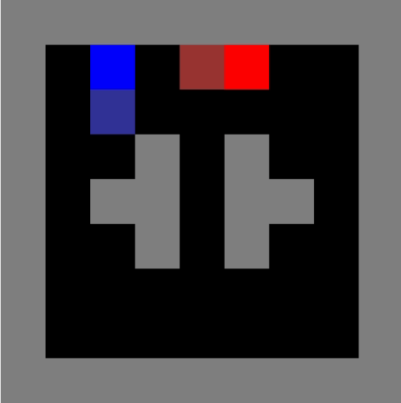

# pytorch-nfsp

An implementation of Deepmind's [Deep Reinforcement Learning from Self-Play in
Imperfect-Information Games](https://arxiv.org/abs/1603.01121) (Heinrich and Silver, 2016) with [LaserTag-v0](https://github.com/belepi93/lasertag-v0). The paper introduces Neural Fictitious Self-Play(NFSP) which is a deep-learning version of FSP in [Fictitious Self-Play in Extensive-Form Games](http://proceedings.mlr.press/v37/heinrich15.pdf) (Heinrich et al. 2015).

# Requirements
```
pytorch 0.4
gym
laser_tag
```

# Examples
`python main.py --env 'LaserTag-small4-v0'` for training

`python main.py --env 'LaserTag-small2-v0' --render` if you want to watch rendered game on screen.

`python main.py --env 'LaserTag-small2-v0' --render --evaluate` if you want to evaluate/enjoy the model which is already trained.

For more details, See `arguments.py`

# LaserTag-small2-v0


This gif is captured while training is in early stage for illustration purpose. Agent get a unit reward for tagging other player with laser.