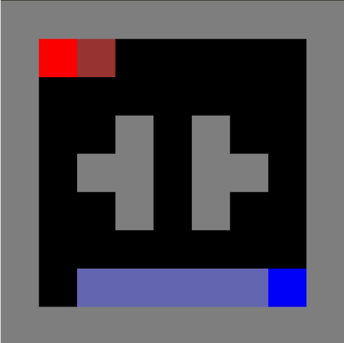
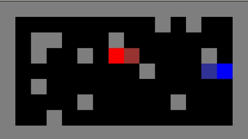
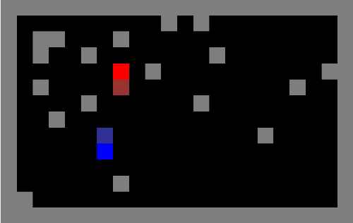

# pytorch-nfsp

An implementation of Deepmind's [Deep Reinforcement Learning from Self-Play in
Imperfect-Information Games](https://arxiv.org/abs/1603.01121) (Heinrich and Silver, 2016) with [LaserTag-v0](https://github.com/belepi93/lasertag-v0). The paper introduces Neural Fictitious Self-Play(NFSP) which is a deep-learning version of FSP in [Fictitious Self-Play in Extensive-Form Games](http://proceedings.mlr.press/v37/heinrich15.pdf) (Heinrich et al. 2015).

# Requirements
```
pytorch 0.4
gym
lasertag
```

# Examples
`python main.py --env 'LaserTag-small4-v0'` for training

`python main.py --env 'LaserTag-small2-v0' --render` if you want to watch rendered game on screen.

`python main.py --env 'LaserTag-small2-v0' --render --evaluate` if you want to evaluate/enjoy the model which is already trained. I included `models/LaserTag-small*-v0-dqn-model.pth` so you can see how trained agents play against each other.

For more details, See `arguments.py`

## LaserTag-small2-v0


## LaserTag-small3-v0


## LaserTag-small4-v0


Agents are trained with NFSP. Agents get a unit reward for touching other agent with laser beam. If an agent is hit twice then that agent will be sent to random respawn place. An episode consists of 1000 frames.